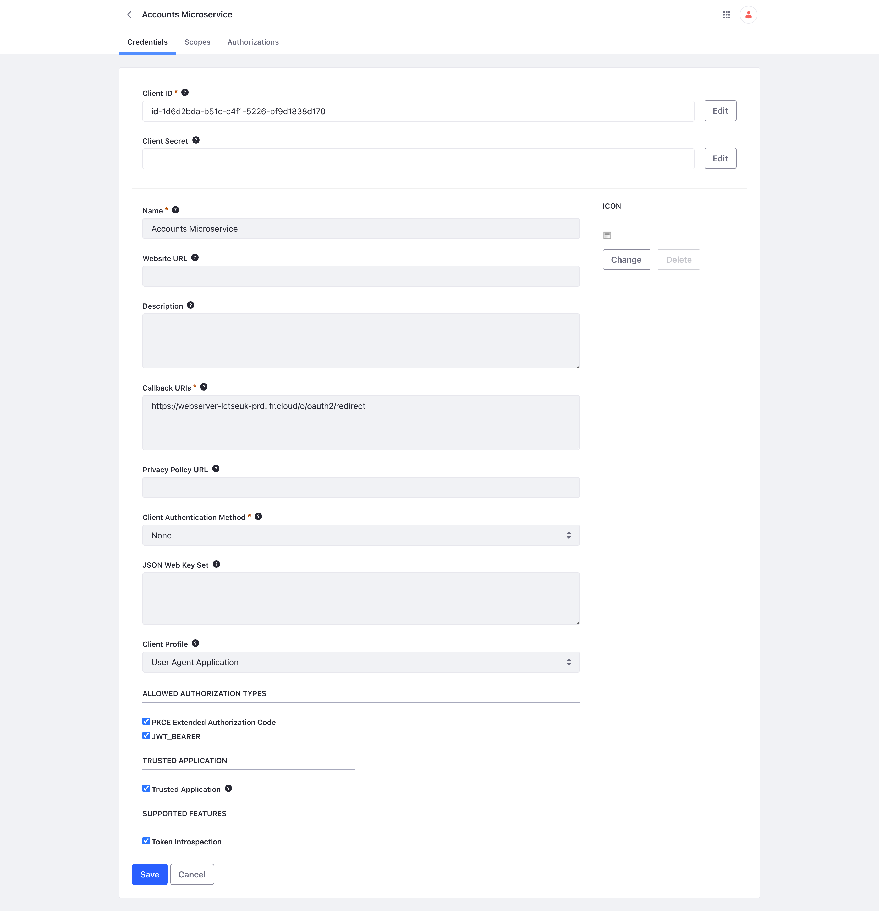
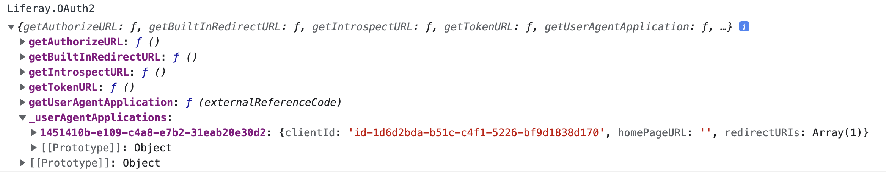
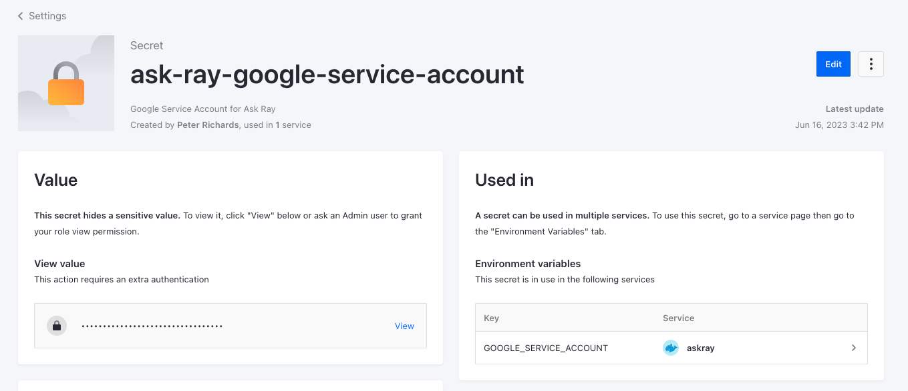
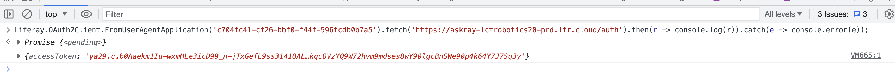

# Ask Ray Chatbot Backend Authentication Service
An example of how a Express can trust Liferay as an OAuth 2.0 Authorisation Server and then request a Google API access token on the callers behalf.

## Usage
### Liferay Experience Cloud
This project can be added as a custom service to a Self Managed Liferay Experience Cloud (LXC SM) environnment.

See how the LCP.json and Dockerfile for more information on the configuration of the deployed custom service.

### Local
It can run locally using `npm run start:dev`

## OAuth 2.0 Configuration
To make this example work you need to create an entry in Liferay's OAuth 2 Adminstration configuration.

### Create OAuth 2 Administration Entry

This is done from the OAuth 2 Administration page of the Control Panel section of the Global Menu.

Field | Value
--- | ---
Name | This value should be meaningful but is not used
Website URL | This should be left blank
Callback URIs | This needs to be the OAuth 2 redirect endpoint for your Liferay instance. https://`<liferay host>`/o/oauth2/redirect
Privacy Policy URL | This should be left blank
Client Authentication Method | None
JSON Web Key Set | This should be left blank
Client Profile | User Agent Application
PCKE Extended Authoirzation Code | Checked
JWT_BEARER | Checked
Trusted Application | Checked

After saving the configuration you need to configure the following

Field | Value
--- | ---
Token Introspection | Checked

Make a note of the Client ID. The Client Secret is not needed.

### Scopes

No scopes are needd for this service.

### Liferay.OAuth2Client and External Reference Code

Liferay provides the Liferay.OAuth2Client to make calls to resource servers, such as this microservice in this example. However, the value required by the Liferay.OAuth2Client.FromUserAgentApplication method is not the Client ID above, it is an external reference code which is generated by Liferay but is not visible from the configuration page.

In order to find the external reference code from the browser, in this screenshot, I am using Chrome's DevTools Console to find the external reference code which is the key of the internal map of Liferay.OAuth2.

## Setting up Google Service Account secret in LXC SM

Follow the steps in the [Liferay Learn](https://learn.liferay.com/w/liferay-cloud/infrastructure-and-operations/security/managing-secure-environment-variables-with-secrets) documentation to create a Production Secret called `ask-ray-google-service-account` to store the Google Service Account JSON.

If you use the same name then the LCP.json for this service already has an environment variable defined which references the secret.

## Validate the service is working

Once the custom service has been deployed in LXC SM, you can validate the service is accessible using the `/health` actuator endpoint. All other endpoints, such as `/auth` should return an 'No authorization header' response.

If the custom service is accessible then you can call the `/auth` endpoint from a logged in session with Liferay DXP using Dev Tools. By replacing the placeholder with the correct OAuth2 external reference code retrieved above, you should receive an access token which can be used to call the assigned Google APIs.

`Liferay.OAuth2Client.FromUserAgentApplication('<oauth2 client external reference code>').fetch('https://askray-lctrobotics20-prd.lfr.cloud/auth').then(r => console.log(r)).catch(e => console.error(e));`

